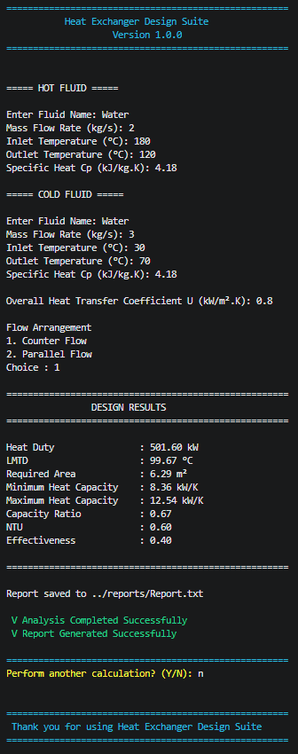

# Heat Exchanger Design Suite

A modern C++ application for designing and analyzing heat exchangers using classical thermal engineering methods.

## Features

- Heat Duty Calculation
- LMTD (Counter Flow & Parallel Flow)
- Heat Transfer Area Calculation
- NTU Method
- Effectiveness Method
- Input Validation
- Report Generation
- Object-Oriented Design
- CMake Build System

## Technologies

- C++17
- CMake
- OOP
- File Handling
- Exception Handling

## Project Structure

```text
include/
src/
reports/
images/
```

## Sample Output



## Engineering Equations

- Heat Duty
- LMTD
- NTU
- Effectiveness

## Future Improvements

- Qt GUI
- CSV Export
- PDF Reports
- Temperature Profile Graphs
- Multiple Heat Exchanger Types